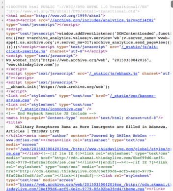
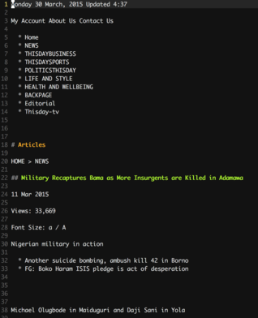
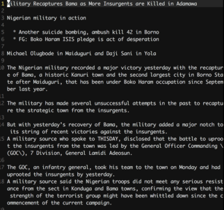
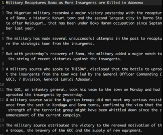
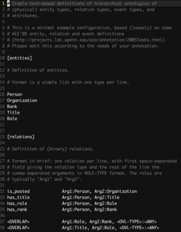
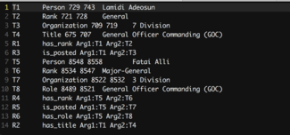

# Security Force Monitor: Development of an NLP training dataset

Author:	Tom Longley (tom@securityforcemonitor.org)
Date:	2019-05-10 
Last updated: 2019-10-24

## Summary

To continue scaling its research Security Force Monitor (SFM) is exploring the use of semi-automated information extraction. 

This repository contains the first steps towards developing a dataset that can be used to train an NLP algorithm to detect biographical details about persons associated with security forces (rank, role in an organization, official title). It contains a workflow that takes raw HTML sources and turns them to plain text for annotation using BRAT, a visual tool for annotating text.

The end product in this repo are 132 text files annotated with over 3600 named entities and the inter-relations, for use in development of an entity extraction pipeline for SFM.

## What's in this repo?

This repo contains the full scripts and process for finding, cleaning and annotating text for use in developing an NLP capability for SFM

```bash
.
├── README.md				
├── common_sources		
│   └── sfm
├── docs			
│   ├── nlp_project_notes.md
│   └── readme_images
├── other_training_data		
├── processing 			
│   ├── A_obtain_uuids
│   ├── B_get_content
│   ├── C_source_metadata
│   └── D_final_cleaned
└── annotated_sources
```

`~/common_sources` contains SFM's raw data about Persons with roles in the Nigerian security forces, and a list of all the sources used to evidence this data. The data structures in use here are partially documented in the [SFM  Research Handbook](https://help.securityforcemonitor.org).


The content of `~/processing` shows how we decided which documents to annotate, and the scripts we used to obtain and process the documents. It's designed to scale up so if we need to 

The material in `~/annotated_sources` is the end product. It contains:

 - cleaned-up UTF-8 text of news articles and reports used by SFM as sources
 - metadata for each source (title, publication, date of publication, url)
 - annotations of named entities and relations between them, using the [BRAT Standoff format](https://brat.nlplab.org/standoff.html), which can be converted for use in a range of NLP toolkits (e.g. [for spaCy](https://github.com/clips/bratreader/tree/master/bratreader))
 - An `annotation.conf` file that defines the named entities and relations, which can be used in BRAT.

The material in `~/other_training_data` is used to provide additional lists of military unit names with which to train the model. Currently it includes:

 - `/other_training_data/dos/output/dos_fmtrpt_nigeria_units.tsv`: list of distinct units that have received training from the US government, as reported in the annual Foreign Military Training and Assistance reports.
 - `/other_training_data/sfm/1_process_out_distinct_units/output/` contains two lists drawn from SFM's Nigeria data:
  - `ng_unit_names_distinct_20191024.tsv`: units and their known aliases, in separate columns
  - `ng_unit_names_and_other_names_collapsed_20191024.tsv`: units and known aliases, collapsed into single list

## Background

In the course of its research, SFM scours a large amount of textual material for details about the the organizational structure, command personnel, geographical footprint and operations of police, military and other security forces. We pick out bits of information - such as the name of a specific unit, or its commander and their rank - and store this in a database. Along with data and time information, the aggregated data develops into a full picture of a security force. We publish this data on our platform, WhoWasInCommand.com, and augment it with allegations of human rights abuses made against units and persons. 

A critical part of our work is picking out bits of information about persons and organizations from news stories, government websites, reports by civil society organizations and international bodies like the UN. Doing this accurately is essential, but time consuming and prone to error. We are exploring the degree to which an NLP/NER step can assist in the identification and extraction of relevant data from within digital content. 

The data assets that we have already developed hold good potential to become training datasets; although the data are directly linked to the source from which they came, the key challenge is re-linking the extracted datapoints to the exact sentence in the source from which the data is taken. In this way, we can create datasets that contain the same values as those published on WhoWasInCommand.com that are also capable of being used to train an NLP algorithm.

The first task we have settled on is the extraction of biographical data from articles. In SFM terms, this means the following:

 * Identifying persons that are associated with a security force.
 * Identifying their rank, titles and roles.
 * Identifying organizations that are security force units.
 * Linking persons to security force units.

To this, we need to identify sources that we have used to evidence all of the above. For example, this sentence from the source [Boko Haram'll soon be contained - GOC](https://web.archive.org/web/20120702163833/http://www.vanguardngr.com/2012/07/boko-haram-ll-soon-be-contained-goc/) contains all the elements we are are looking for:

> "General Officer Commanding 3 Armoured Division of the Nigerian Army, Major General Jack Nwaogbo, has again re-assured Nigerians that the Boko Haram insurgency would soon be contained."

Here's what we'd pull out, and add to our dataset:

 * Name of person: "Jack Nwaogbo"
 * Rank of person: "Major General"
 * Title of person: "General Officer Commanding"
 * Organization: "3 Armoured Division"
 * Role of person: "Command"

To use this to develop and NLP extraction pipeline, we would need to annotate the text in a machine readable way. Something like this flags entities in the sentence:

> "[person:role]General Officer Commanding[/person:role] [org:name]3 Armoured Division[/org:name] of the Nigerian Army, [person:rank]Major General[/person:rank] [person:name]Jack Nwaogbo[/person:name], has again re-assured Nigerians that the Boko Haram insurgency would soon be contained."

We would also have to establish the connections between the tagged persons, roles, organizations and so on. To accomplish this we need to decide on the basic way that the source data will be encoded, and the appropriate toolset for doing this. Further, we have to idenitfy the range of different NLP challenges that our dataset can be used to address - for example, intra-document entity resolution -  and the extent to there is a useful overlap between academic interest and SFM needs.

The outcome of this annotation work wwould render the data we have developed readable to a machine learning process based on NLP. It is also an opportunity to explore the assess the workload involved in developing the data, thinking about the sort of workflows we would need, and experimenting with the various toolsets that are available.  


##  Developing a training dataset using the Berkeley Rapid Annotation Tool (BRAT)

Developing a training dataset is time consuming, so we will start with a sample from our data. The slice of our data that holds solid potential is our data on persons with commanding roles in the Nigerian security forces. We presently have data on 662 persons of varying rank and title, and the source data is all in English which make annotation far simpler given the current language skills available to us. Every source we use has a `access point`, which is referenced by a UUID. This UUID is what we will use to identify our sources throughout this process.

### Nigerian command personnel: finding the right sources to use

Underpinning the data we hold on 662 persons are 1210 sources (which can be news articles, pages from government websites, NGO reports, etc). To create a profile of a person, we use a variety of sources - it may be that many of the sources are only used one, to evidence a single piece of data. The reverse is also true, that a single sources may contain hundreds of datapoints about a person, or a number of persons.

Ideally, for the purposes of developing a starter dataset for NLP, we want to use sources that contain a number of datapoints about a specific person, much like the example I gave about. This is quicker to annotate. Let's call these "information rich sources". We can find these easily by filering for sources that have been used to evidence five key biographical datapoints: name (or alias), organization, rank, role, title. Applying these filters to our data leaves us with a 220 sources covering 441 rows of person data (matched either or person name or an alias). Remember that we use the UUID to identify the source inside the data - we can then match it to metadata, including its title, source URL and Internet Archive URL.

Of the 220 information rich sources, we are able to grab the raw HTML from the Internet Archive - containing the text - of 132. Many of these sources come from the website AllAfrica.com, a subscription site that does not allow the Internet Archive to capture a full version of its pages. Nonetheless, this gives us a decent set of content to work with.

### Extracting plain text from HTML

We need to get the plain text out from the sources, bringing them into a standard format that can be annotated. To do this, we will use a combination of manual and automated steps. After grabbing the raw HTML, we used a helpful tool called `htmltext`, which is configured to output a very plain Markdown-formatted version of the HTML. We remove everything except the title and body - we do this by hand because the content is quite variable. We then automatically process it to remove stuff like consecutive spacing, weird characters, empty lines and so on. 

We identify the source by its UUID, which we keep in the filename. This means the content of the file is strictly processable text, rather than any metadata about the source. Later, we may choose to encode the full corpus in a more comprehensive way but for now we are focussed on rapidly developing a training dataset.

### Generating metadata for source

For each source, we generate a simple header file that lists out its metadata. The format for these files is `[source_uuid]_meta`. As mentioned above, we will keep these separate for the meantime; we can easily concatenate them with the source text at a later point when we have decided on the format of the text corpus.

### Staging for annotation

The annotation tool we have chosen is [BRAT](http://brat.nlplab.org/index.html), a browser-based system that can be deployed quickly on a local machine. It will take a collection of plain-text formatted documents, and give a user the power to annotate the text through a fairly simple, inuitive interface. The annotations are stored in a separate `.ann` file. 

The entities and their relations are defined in a `annotation.conf` file placed in the same directory as the document collection. This looks like this:

```bash
[entities]
Person
Organization
Rank
Title
Role
[relations]
is_posted             Arg1:Person, Arg2:Organization
has_title             Arg1:Person, Arg2:Title
has_role              Arg1:Person, Arg2:Role
has_rank              Arg1:Person, Arg2:Rank
<OVERLAP>             Arg1:Role, Arg2:Rank, <OVL-TYPE>:<ANY>
<OVERLAP>             Arg1:Title, Arg2:Role, <OVL-TYPE>:<ANY>
```

### Using the data in your own BRAT instance

- Install BRAT. 
- Copy `~/annotated_sources/` to `~/brat/data/sfm`. 
- Keep the `.ann` and the`.txt` files with just the source text; but delete the source metadata files (those ending with `_meta.txt`)
- Open BRAT and open the `sfm` document collection. It *should* just work.

## Data processing workthrough: from raw source to annotated text

### Finding an information-rich source

The first information-rich source has the following UUID `002fcbe4-503c-400d-8cc0-77a395570ade`. 

Our process lists out what data we can expect to find in this source, and that we will annotate using BRAT:

Field|Values 1|Values 2
---|---|---
matched_on|name|alias
person:name|Lamidi Adeosun|Fatai Oladipo Alli
person:alias|Adeosun;LO Adeosun;O Adeosun|Fatai Alli ; F.O. Alli ; F.O.Alli ; FO Ali
person:org|7 Division|3 Armoured Division
person:role|Commander|Commander
person:title|General Officer Commanding|General Officer Commanding
person:rank|Major General|Major General

### Finding the Archive URL of the source

The metadata of source `002fcbe4-503c-400d-8cc0-77a395570ade` is contained in SFM's source masterlist, a flat data table:

Field|Value
---|---
Title|Military Recaptures Bama As More Insurgents Are Killed in Adamawa
Publication date|2015-03-11
Source URL|http://www.thisdaylive.com/articles/military-recaptures-bama-as-more-insurgents-are-killed-in-adamawa/203836/
Archive URL|https://web.archive.org/web/20150330042016/http://www.thisdaylive.com/articles/military-recaptures-bama-as-more-insurgents-are-killed-in-adamawa/203836/ 
Publication|This Day
Country|Nigeria

The original source URL is not live anymore - it serves a 404 when accessed - so we will grab the text of the article from the copy we have stored in the Internet Archive.


### Getting the Internet Archive HTML of the source 

We can make a local copy of the HTML of source `002fcbe4-503c-400d-8cc0-77a395570ade` from the Internet Archive snapshot of the article. 





### Converting HTML to simple Markdown, and cleaning it up

We run the copy of the Internet Archive HTML through `html2text`:



A simple cleanup by hand removes text we don't need, such as adverts, other links and so on:



Deeper cleaning removes escaped characters, consecutive and trailing whitespace etc:



### Creation of metadata file

We parse the data out of SFM's master source list, and create a simple text file containing the metadata for the source:


This can be appended to the file containing the full text of the source; the format of the file is easy to change too (for example it could be used to create a TEI-C header).

### Creatio of `.ann` file

Create a file called `002fcbe4-503c-400d-8cc0-77a395570ade.ann` which will be used by BRAT to store annotations for `002fcbe4-503c-400d-8cc0-77a395570ade.txt` which contains the text of the source.

### Define the entities and relationships for use in BRAT

Create an `annotation.conf` file in the project, and store it alongside the collection:



### Annotation in BRAT

Source `002fcbe4-503c-400d-8cc0-77a395570ade.txt` is placed in BRAT's data directory, as part of a collection. We then fire up BRAT and can capture the data using the GUI:


The annotations are stored in a simple text format, in `002fcbe4-503c-400d-8cc0-77a395570ade.ann`:




These annotations can be transformed into formats for use in different machine learning and NLP workflows.
